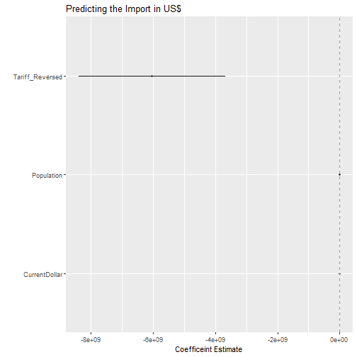
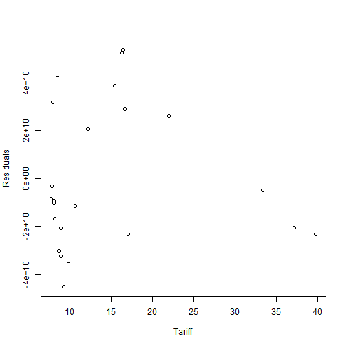
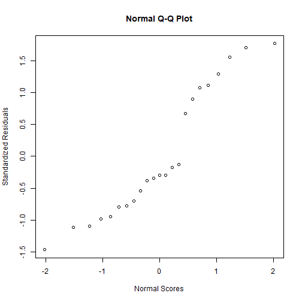
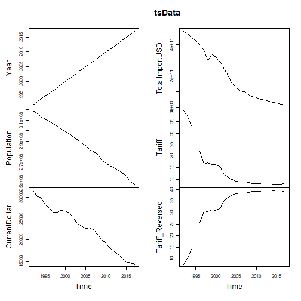

<h1 align="center" style="color:blue">Looking at the correlation between the tariff on Chinese goods and the amount of Chinese import in the US</h1>

By: **Jose Luis Gomez-Angulo**, **Becky Kim** and **Tongtong Xu**
<br>
<br>

______

### Our group is interested in the international trade trends, exclusively between China and the US, for the past 26 years


Installing packages. It sometimes requires restarting R session and deletes variables
So we're installing them upfront

```r
listOfPackages0 <- c("zoo","forecast", "MARSS")  
new.packages0 <- listOfPackages0[!(listOfPackages0 %in% installed.packages()[,"Package"])]
if(length(new.packages0)) install.packages(new.packages0)

library(zoo) # Importing zoo library to take care of missing data while
            # decomposing the time series data
library(forecast) # forecast library contains forecasting funcs for time series
                  # and linear models
library(MARSS) # Multivariate time-series analasys
```

Download the file from the RAW github file

```r
download.file("https://raw.githubusercontent.com/brmkim/599GroupRepo/master/tariff_import.csv", 
              destfile = "/tmp/test.csv", method = "curl")
df <- read.csv("/tmp/test.csv", stringsAsFactors = FALSE)
```

These are the contents:


```r
str(df)
```

```
## 'data.frame':	26 obs. of  7 variables:
##  $ Year           : int  1992 1993 1994 1995 1996 1997 1998 1999 2000 2001 ...
##  $ Population     : int  318868000 316168000 313443000 311116000 308827000 306553000 304280000 301483000 299106000 296824000 ...
##  $ CurrentDollar  : int  31653 30176 30027 28281 27554 26558 26530 26964 26804 26352 ...
##  $ X2017Dollar    : int  32751 31276 31649 30250 30097 29923 30385 30775 31767 32117 ...
##  $ TotalImportUSD : num  4.83e+11 4.68e+11 4.40e+11 4.26e+11 3.99e+11 ...
##  $ Tariff         : num  39.7 37.1 33.3 NA 22 ...
##  $ Tariff_Reversed: num  7.74 10.35 14.13 NA 25.43 ...
```
Data size: 26 observations on 7 variables (actually 6)

### DATA DESCRIPTION 
'Year': Year
'Population': population of the US in that year
'CurrentDollar': median income of US individuals (not household) in current dollar
'x2017Dollar': median income converted to 2017 dollar
'TotalImportUSD': total amount of import measured in USD
'Tariff': mean percentage tariff in that year
'Tariff_Reversed': reversed value of 'Tariff' for the regression purpose

### Making plots to visualize the affect of the proposed predictors on the 
### dependent variable.

```r
# Check if the packages, required for drawing dot-and-whisker plot, are installed. # If not, install them
listOfPackages <- c("car","dotwhisker","ggplot2", "dplyr")  
new.packages <- listOfPackages[!(listOfPackages %in% installed.packages()[,"Package"])]
if(length(new.packages)) install.packages(new.packages)

# Call the libraries
library(car)
library(ggplot2)
library(dotwhisker)
library(broom)
library(dplyr)
```


## Bivariate Plot for Tariff and Total Import in USD


```r
scatterplot(df$TotalImportUSD~df$Tariff_Reversed, 
        xlab = "Percentage Tariff", ylab = "Total Import from China in USD",
        main = "Impact of Tariff on Total Import from China")
```


```r
plot(df$Tariff~df$Year,main = "Change of Tariff over the Years", xlab = "Year",ylab = "Percentage Tariff")
```


## The Reduction in the Tariff on China
The decrease of tariffs on Chinese imports can be attributed to the World Trade
Organizations (WTO) in 1995, when China became a member of the international trade
agreement.  
China was a "founding member" in document under the General Agreement on Tariffs and
Trade (GATT), the WTO's predecessor. But it was not until WTO that China was formally
accepted as a trade partner.
In 1986 China had formally requested to become a part of the GATT, so there were
ongoing negotiations for WTO accession and tariff reductions from that period. 
With the WTO taking effect in 1995, the tariff on China decreased dramatically around
that time and gradually afterwards.


## Multivariate plots:


```r
import.lm=lm(as.numeric(TotalImportUSD) ~ Tariff_Reversed + Population + 
               CurrentDollar, data=df)

summary(import.lm)
```

```
## 
## Call:
## lm(formula = as.numeric(TotalImportUSD) ~ Tariff_Reversed + Population + 
##     CurrentDollar, data = df)
## 
## Residuals:
##        Min         1Q     Median         3Q        Max 
## -4.526e+10 -2.198e+10 -9.200e+09  2.752e+10  5.357e+10 
## 
## Coefficients:
##                   Estimate Std. Error t value Pr(>|t|)    
## (Intercept)     -1.693e+12  4.948e+11  -3.421  0.00287 ** 
## Tariff_Reversed -6.035e+09  1.200e+09  -5.028 7.47e-05 ***
## Population       8.461e+03  2.505e+03   3.378  0.00316 ** 
## CurrentDollar   -1.428e+07  1.032e+07  -1.384  0.18243    
## ---
## Signif. codes:  0 '***' 0.001 '**' 0.01 '*' 0.05 '.' 0.1 ' ' 1
## 
## Residual standard error: 3.229e+10 on 19 degrees of freedom
##   (3 observations deleted due to missingness)
## Multiple R-squared:  0.9642,	Adjusted R-squared:  0.9586 
## F-statistic: 170.8 on 3 and 19 DF,  p-value: 6.424e-14
```

Out of three independent variables, the percentage of tariffs and US population 
variables are shown to be statistically significant at 0.001 and 0.01 levels of
confidence respectively.

### Intepretation:  
As the p-value is less than 0.05, we reject the null hypothesis. Therefore
there is a significant relationship between the variables. 
Adjusted R-squared value is 0.9586. It indicates that the model explains the variability of the response data around its mean.


Creating the dot-and-whisker plot

```r
model1_t = tidy(import.lm) %>%   
    mutate(model = "Model 1")

dwplot(model1_t) +
    geom_vline(xintercept = 0, 
               colour = "grey60", 
               linetype = 2) +
    scale_colour_grey(start = .1, end = .7) +
    xlab("Coefficeint Estimate") +
    ylab("") +
    ggtitle("Predicting the Import in US$")
```



The reversed tariff's range is too big that it's impossible to see that of 
populationUS and medianIncomeCurrentDollar. 
I eliminated the reversedTariff and see the dot-and-whisker graph for the other
two variables. It turned out, population is still on the 0, and CurrentDollar shoed a range of negative to positive values. I thought showing the graph was of little meaning, since CurrentDollar was not statistically significant in explaining the Total Import. So I did not include the regression nor the graph.


## Plotting residuals 

```r
import.res = resid(import.lm)
tariffTable = df$Tariff
# length difference between above two vars is giving me trouble
# so removing the NA values from tariffTable vector
tariffTable = tariffTable[!is.na(tariffTable)]

plot(tariffTable, import.res,
      ylab="Residuals", xlab="Tariff")
```



```r
#abline(0,0)
```

## Normal probability plot of residuals

```r
import.stdres = rstandard(import.lm)

qqnorm(import.stdres, xlab="Normal Scores", ylab="Standardized Residuals")
```



```r
#qqline(import.stdres)
```


# Time-series Regression 

```r
# Reversing the order of the year from sml to lg
#dfReverseOrder = df[order(df$Year), ]
#dfReverseOrder$Year = NULL

# Removing unnecessary columns
df$X2017Dollar = NULL
#dfReverseOrder$tariffPercentage = NULL

# ts() function converts a numeric vector into a time-series object
tsData = ts (df, start=df[1,1], end=df[26,1], frequency=1) # yearly data
#tsData
```

Graphing the time-series data

```r
plot(tsData)
```


Notice the gap in the lines due to the missing values


Filling the missing tariff values with approximated values (Years 1995, 2012, 2013) 
Chose not to exclude NAs because later excluded years will cause problems

```r
tsDataNoNA = na.approx.default(tsData)

seriesData = ts(tsDataNoNA, start = tsDataNoNA[1,1], end=tsDataNoNA[26,1])
plot.ts(seriesData) # No gaps
```


```r
## Trim Columns
reducedCols = tsDataNoNA[,c(1,3,4,5)] # Making a dataframe composed of 
                         # Median Income, Total Imports in USD, and Tariff %
reducedTS = ts(reducedCols, start = reducedCols[1,1], end=reducedCols[26,1])
```


```r
#install.packages("forecast")
#library(zoo)
#library(forecast)

## "forecast() function is a generic function for forecasting from time series models.
##  The function invokes particular methods which depen on the class of the first argument"
seriesForecast = forecast(reducedTS, h=8)  # forecasting next 8 years

## Show predicted values in tables and graph
seriesForecast
```

```
## Year
## 
## CurrentDollar
## 
## TotalImportUSD
## 
## Tariff
```

```r
plot(seriesForecast)    # shows a 80%/95% prediction intervals for the forecast 
```


### The End 


-----------------------------------------------------------------------------------

Below is an extra part for making a PDF document from Rmd file


Instructions from
http://rprogramming.net/create-html-or-pdf-files-with-r-knitr-miktex-and-pandoc/

Step 1. Install MiKTex from  http://miktex.org/download
Step 2. Install Pandoc https://code.google.com/archive/p/pandoc/downloads
Step 3. Install Knitr and Markdown
SteP 4. Create .Rmd file
Step 5. Produce HTML and PDF output files


```r
### Makng a PDF Document ### 

# Set working directory. THIS IS AN IMPORTANT STEP.
setwd("C:/Users/boram/Documents/GitHub/599GroupRepo")

knitrPackages <- c("knitr","markdown")  
newpackages <- knitrPackages[!(knitrPackages %in% installed.packages()[,"Package"])]
if(length(newpackages)) install.packages(newpackages)
 
  # x = rev(.packages())
  # if (file.exists("C:/Program Files/R/R-3.5.3/library")) 
  #     x = setdiff(c(readLines("C:/Program Files/R/R-3.5.3/library"), x), .base.pkgs)
  # writeLines(x, "C:/Program Files/R/R-3.5.3/library")

require(knitr)
require(markdown)


# Create .md, .html, and .pdf files
knit("599Final.Rmd")
```

```
## 
## 
## processing file: 599Final.Rmd
```

```
## 
  |                                                                       
  |                                                                 |   0%
  |                                                                       
  |..                                                               |   3%
##   ordinary text without R code
## 
## 
  |                                                                       
  |....                                                             |   7%
## label: unnamed-chunk-29
## 
  |                                                                       
  |.......                                                          |  10%
##   ordinary text without R code
## 
## 
  |                                                                       
  |.........                                                        |  14%
## label: unnamed-chunk-30
## 
  |                                                                       
  |...........                                                      |  17%
##   ordinary text without R code
## 
## 
  |                                                                       
  |.............                                                    |  21%
## label: unnamed-chunk-31
## 
  |                                                                       
  |................                                                 |  24%
##   ordinary text without R code
## 
## 
  |                                                                       
  |..................                                               |  28%
## label: unnamed-chunk-32
## 
  |                                                                       
  |....................                                             |  31%
##   ordinary text without R code
## 
## 
  |                                                                       
  |......................                                           |  34%
## label: unnamed-chunk-33
```

```
## 
  |                                                                       
  |.........................                                        |  38%
##   ordinary text without R code
## 
## 
  |                                                                       
  |...........................                                      |  41%
## label: unnamed-chunk-34
## 
  |                                                                       
  |.............................                                    |  45%
##   ordinary text without R code
## 
## 
  |                                                                       
  |...............................                                  |  48%
## label: unnamed-chunk-35
```

```
## 
  |                                                                       
  |..................................                               |  52%
##   ordinary text without R code
## 
## 
  |                                                                       
  |....................................                             |  55%
## label: unnamed-chunk-36
```

```
## 
  |                                                                       
  |......................................                           |  59%
##   ordinary text without R code
## 
## 
  |                                                                       
  |........................................                         |  62%
## label: unnamed-chunk-37
```

```
## 
  |                                                                       
  |...........................................                      |  66%
##   ordinary text without R code
## 
## 
  |                                                                       
  |.............................................                    |  69%
## label: unnamed-chunk-38
## 
  |                                                                       
  |...............................................                  |  72%
##   ordinary text without R code
## 
## 
  |                                                                       
  |.................................................                |  76%
## label: unnamed-chunk-39
```

```
## 
  |                                                                       
  |....................................................             |  79%
##   ordinary text without R code
## 
## 
  |                                                                       
  |......................................................           |  83%
## label: unnamed-chunk-40
```

```
## 
  |                                                                       
  |........................................................         |  86%
##   ordinary text without R code
## 
## 
  |                                                                       
  |..........................................................       |  90%
## label: unnamed-chunk-41
```

```
## 
  |                                                                       
  |.............................................................    |  93%
##   ordinary text without R code
## 
## 
  |                                                                       
  |...............................................................  |  97%
## label: unnamed-chunk-42
```

```
## 
  |                                                                       
  |.................................................................| 100%
##   ordinary text without R code
```

```
## output file: 599Final.md
```

```
## [1] "599Final.md"
```

```r
markdownToHTML("599Final.md", "599Final.html", options=c("use_xtml"))
system("pandoc -s 599Final.html -o 599Final.pdf")
```


